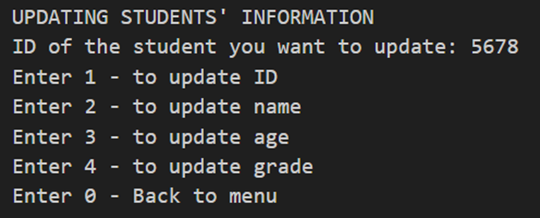

# Term 2 year 1
# Quiz
### Documentation
provide soon...
# Library system
### Documentation
provide soon...

# Student record management system
### Documentation

#### Overview:

This Java program implements a Student Record Management System for a university. It allows administrators to add new students, update student information, and view student details.

#### Classes:

1. **Student Class:**
    - `Student`: Represents a student with private instance variables for name, ID, age, and grade. Includes a constructor and getters/setters.

2. **Student Management Class:**
    - `StudentManagement`: Manages the list of students and provides methods for adding, updating, and viewing student information.

3. **Custom Error Handler Class:**
    - `NonNegativeNumber`: Handles cases where user provides anegative input for age, grade and ID.


#### How to Run:

1. **Compile the Program:**
    - Save the provided code in a file named `StuRecordMgtSystem.java`.
    - Open a terminal and navigate to the directory containing the file.
    - Compile the program using the command: `javac StuRecordMgtSystem.java`

2. **Run the Program:**
    - Run the compiled program with the command: `java StuRecordMgtSystem`

#### Administrator Interface:

Upon running the program, the administrator is presented with a menu:

```
WELCOME!!! Administrator, what option?
new - To add new student. 
upd - To update student.  
view - To student details.
ext - To exit.
```

#### Interacting with the Interface:

1. **Add a New Student:**
    - Enter the option `new`.
    - Enter the student's name, ID, age, and grade when prompted.

2. **Update Student Information:**
    - Enter the option `upd`.
    - Enter the ID of the student for updating.
    - Choose from the options the details to be updated and enter the new details.

    ```
    UPDATING STUDENTS' INFORMATION
    ID of the student you want to update: 5678
    Enter 1 - to update ID   
    Enter 2 - to update name 
    Enter 3 - to update age  
    Enter 4 - to update grade
    Enter 0 - Back to menu   
    ```


3. **View Student Details:**
    - Enter the option `view`.
    - Choose from the options the view.

4. **Exit:**
    - Enter the option `ext` to exit the program.

#### Error Handling:

- The program handles cases where the provided student ID is not found.
- Invalid inputs (non-numeric values, etc.) are also handled.

#### Example Interaction:

```
WELCOME!!! Administrator, what option?
new - To add new student. 
upd - To update student.  
view - To student details.
ext - To exit.
new

ADDING NEW STUDENT

Student ID: 5678
Student name: Ada Okonkwo
Student age: 25
Student grade: 90
1 New student details has been added

WELCOME!!! Administrator, what option?      
new - To add new student.
upd - To update student.
view - To student details.
ext - To exit.

view

VIEW STUDENTS' INFORMATION
Enter 1 - to view a student record
Enter all - to view the entire list
Enter 0 - exit from VIEW

all  

Total Number of Students: 1
ID             Name           Age            Grade          
---------------
5678           Ada Okonkwo    25             90.00   

Enter 1 - to view a student record
Enter all - to view the entire list
Enter 0 - exit from VIEW
0

WELCOME!!! Administrator, what option?      
new - To add new student.
upd - To update student.
view - To student details.
ext - To exit.

UPDATING STUDENTS' INFORMATION
ID of the student you want to update: 5678
Enter 1 - to update ID   
Enter 2 - to update name 
Enter 3 - to update age  
Enter 4 - to update grade
Enter 0 - Back to menu   
1

Update student ID: 2345 

Students' details successfully updated

Enter 1 - to update ID
Enter 2 - to update name
Enter 3 - to update age
Enter 4 - to update grade
Enter 0 - Back to menu

0

WELCOME!!! Administrator, what option?      
new - To add new student.
upd - To update student.
view - To student details.
ext - To exit.
```
